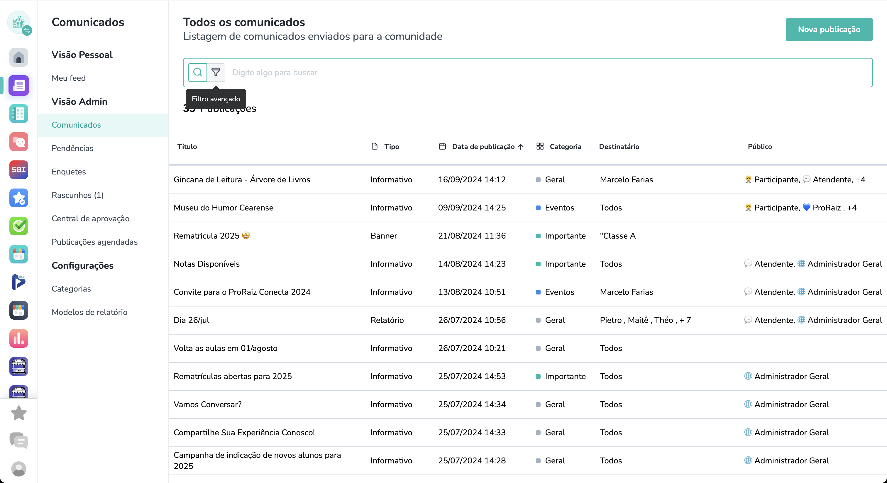

# Desafio técnico - Estágio em Desenvolvimento de Software

## Objetivo
Você está trabalhando em um projeto no time de Layers para Escolas em que o aplicativo de Comunicados precisa de um filtro para os posts. O filtro deve ser capaz de filtrar os posts por título, tipo, categoria, target, data de publicação e data de criação.

O seu desafio é implementar a função `search` que recebe um filtro e retorna um array de posts filtrados e ordenados.



## Especificações dos Posts
O post é um objeto que segue a seguinte estrutura:
```typescript
type Post = {
  id: number
  title: string
  kind: 'report' | 'gallery' | 'video' | 'banner' | 'informative'
  publishedAt: Date
  createdAt: Date
  category: string[]
  targets: string[]
}
```

## Especificações do Filtro
O filtro é um objeto que segue a seguinte estrutura:
```typescript
type PostFilter = {
  title?: string
  kind?: 'report' | 'gallery' | 'video' | 'banner' | 'informative'
  category?: string
  target?: string
  publishedAtStart?: Date
  publishedAtEnd?: Date
  createdAtStart?: Date
  createdAtEnd?: Date
}
```

Caso o campo seja passado, ele deverá ser considerado no filtro, caso contrário, ele pode ser ignorado.
Por exemplo, se os campos `category` e `kind` forem passados, o filtro deve retornar apenas os posts que possuem a categoria e o tipo passados.

O retorno da função deve ser um array de Posts que atendem aos critérios de filtro e estejam ordenados por `publishedAt`.

### Campos do Filtro

| Campo | Descrição |
| ----- | --------- |
| title | Filtrar posts que possuem o título a substring passada no PostFilter.title, sendo case insensitive. |
| kind | Filtrar posts que possuem o kind igual ao passado no PostFilter.kind. |
| category | Filtrar posts que possuem a categoria igual a passada no PostFilter.category. |
| target | Filtrar posts que incluem o target passado no PostFilter.target no seu array de targets. |
| publishedAtStart | Filtrar posts que possuem a data de publicação maior ou igual a passada no PostFilter.publishedAtStart. |
| publishedAtEnd | Filtrar posts que possuem a data de publicação menor ou igual a passada no PostFilter.publishedAtEnd. |
| createdAtStart | Filtrar posts que possuem a data de criação maior ou igual a passada no PostFilter.createdAtStart. |
| createdAtEnd | Filtrar posts que possuem a data de criação menor ou igual a passada no PostFilter.createdAtEnd. |

## Observações
- O projeto utiliza Typescript e Node.js.
- A função de filtro deverá ser implementada no arquivo `search.ts`.
- Os testes estão implementados no arquivo `validate.ts` e você pode rodá-los com `yarn test`.
- Você pode testar manualmente a função editando o arquivo `index.ts` e rodando `yarn start`.
- Não é permitido o uso de bibliotecas externas.
- Não é permitido o uso de ferramentas GPTs.
- Pode consultar documetações na internet.
- Pode perguntar dúvidas sobre o desafio e sobre o código, nós podemos responder :).

## Setup
Para rodar o projeto, é necessário ter o Node.js instalado. Para instalar as dependências, basta rodar o comando `yarn install`.

Para executar, basta rodar o comando `yarn start`.

Para rodar os testes, basta rodar o comando `yarn test`.
